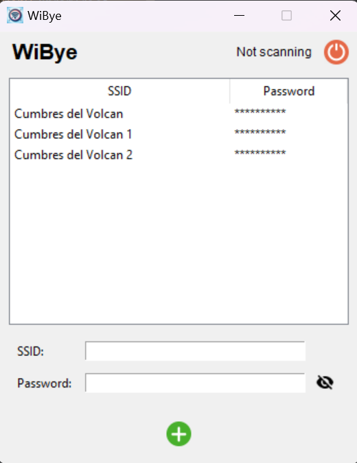

# Wi-Bye
The app that looks and connects to wireless connection networks while you're carefree, almost.

# Motive
Sometimes you find yourself in a place that has many networks, but none of them is actually stable, so you keep connecting to others until it is stable enough for you, or you locate yourself in a place with the best physical access to the Wifi signals. 

Well, no more!

# Usage
Wi-Bye lets you set all the networks in your area, with their password. Once all set, the app scans and connects to any networks, as long as you are still not online. You just need to set the credentials and click the scan button on the right top.

# Requirements
Windows only.
Python 3.12+

# Installation
1. Clone the repo.
2. Run ``pip install -r requirements.txt``
4. Run the app.

## Screenshots

## Logo

